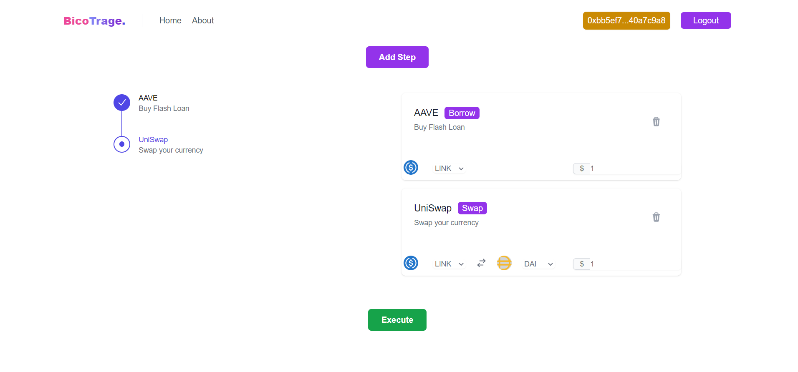

# ETHIndia 2022 Hackathon

## BicoTrage - An Arbitrage Platform Developed using Biconomy

<br>

<br>

<br>
 
## Demo

<br>


<br>

Github : <a style="margin-bottom: 5px;" href="https://github.com/shivamangina/ethindia-2022" target="_blank"> Repo Link </a>

Video : <a style="margin-bottom: 5px;" href="https://www.youtube.com/watch?v=ZItkM2ZDX4o" target="_blank"> Youtube Link </a>

## Problem

In web3 world, if one wants to interact with the ecosystem, he needs to create a wallet and pay a gas fee every time he uses the service. In both cases, the user interfaces are not friendly to non-crypto users.

When it comes to arbitrage, a user must buy and sell crypto assets on multiple exchanges, swaps, etc. During these scenarios, the user will incur huge gas and time fees. Particularly in the crypto space, the market can deviate in a matter of seconds.

## Solution

Our Arbitrage Platform is built with the **Biconomy SDK**, where we're helping the users to make a arbitage easily with few clicks and saving time and money.

### Features used from Biconomy:

1. Social Login System : By using this, any web2/web3 user can easily log in to the platform without any hassle.
2. Transaction Batch : The Biconomy batch feature allows all trades across all dexes and swaps to be made together and can be processed as a single transaction.
3. Gas less Transactions: Through this feature, users will no longer have to pay for gas fees during the flow.

## Stack We Used

1. Frontend: We used **React JS**, Tailwind CSS for UI and **ethers** library to fetch details from contract.

2. Blockchain :
   1. Biconomy: We used **Biconomy SDK** for features like social login, gas less transactions and transaction batches.
   2. Chain: **Ethereum Goerli** to connect with blockchain on testnet.
   3. RPC URL : We used **Quick Node** Ethereum RPC url to connect to the goerli chain.

# Architecture


<br>

## Steps to Run the Project

1. Clone the repo

```
git clone https://github.com/shivamangina/ethindia-2022
```

2. Install the dependencies.

```
 npm i
```

3. Start the app using command

```
npm start
```

4. Open this link in browser http://localhost:3000

5. Hey, You just ran the code in your system, thats it. Now you can try doing swaps between tokens in Uniswap and other exchanges.

<br>

## Meet Our Team

<div style="display: flex; justify-content: space-between; align-items: center;">
   <p style="flex:1">Shiva Kumar: </p>
   <div style="flex:4; justify-content: space-between;">
      <a href="https://www.linkedin.com/in/shivamangina/" target="_blank">
      
      </a>
      <a href="https://twitter.com/shivakmangina" target="_blank">
      
      </a>
      <a href="https://www.instagram.com/shiva_mangina" target="_blank">
      
      </a>
      <a href="https://github.com/shivamangina" target="_blank">
      
      </a>
   </div>
</div>

<div style="display: flex; justify-content: space-between; align-items: center;">
   <p style="flex:1">Sandeep Kumar: </p>
   <div style="flex:4; justify-content: space-between;">
      <a href="https://www.linkedin.com/in/satyasandeep" target="_blank">
      
      </a>
      <a href="https://twitter.com/satyasandeep76" target="_blank">
      
      </a>
      <a href="https://www.instagram.com/satyasandeep007" target="_blank">
      
      </a>
      <a href="https://github.com/satyasandeep007" target="_blank">
      
      </a>
   </div>
</div>
